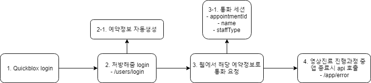

# 처방해줌
* server api for mobile app

#### 버전
+ v1

#### Api Host : 
+ https://52.78.64.41/api/v1

#### Api List
* [로그인](#로그인)
* [영상진료에러](#영상진료에러)

***

### 로그인
```
유저 로그인
---------
POST /users/login
```

**Request Body**
```
{
    internalId: "98735405",   // quickblox 내부 id
    qbId: "login",   // quickblox login id
    qbPassword: "password",   // quickblox password
    username: "nickname",   // quickblox name
    deviceOs: "Android"   // 기기 os ["Android" , "Ios"]
}
```

**Response Body**
```
{
    id: 1
}
```

***

### 영상진료에러
```
영상진료 앱 비정상 종료
---------
POST /app/error
```

**Request Body**
```
{
    appointmentId: 1,   // 예약번호
    userId: 1,   // 처방해줌 user id
    staffType: 'aide'   // caller type ["aide", "doctor"]
} 
```

**Response Body**
```
{
    id: 1
}
```

***

### 프로토타입 시나리오



1. Quickblox login
    * room 아무거나 상관없음
2. 처방해줌 login
3. 통화 요청
    * 세션 ex) {appointmentId: 1, name: '줌', staffType: 'aide'}
4. 앱 비정상 종료